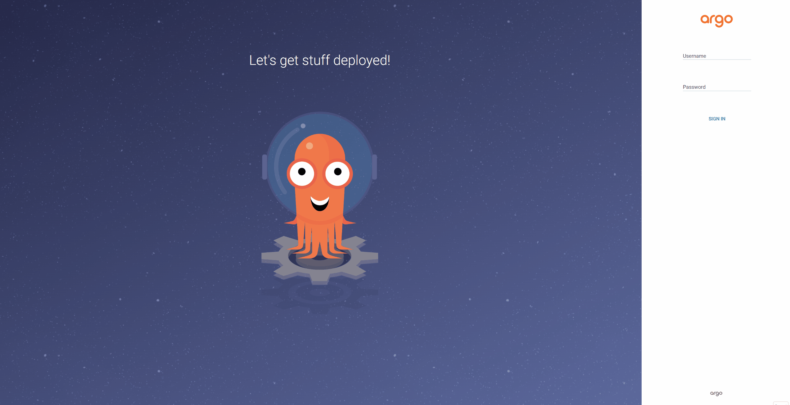

# AsciiArtify

PoC-стартап: перетворення зображень в ASCII-art за допомогою Machine Learning.

Цей репозиторій містить документацію етапів **Concept** і **Proof of Concept**: вибір інструменту для локального Kubernetes-кластера та розгортання GitOps-системи на його базі.

## Документація

**[doc/Concept.md](doc/Concept.md)** - порівняльний аналіз minikube, kind та k3d: характеристики, матриця порівняння, переваги й недоліки, ризики ліцензування Docker, альтернатива Podman, демонстрація та висновки.

**[doc/POC.md](doc/POC.md)** - розгортання ArgoCD на k3d: встановлення, доступ до веб-інтерфейсу через Traefik, облікові записи команди з RBAC-обмеженнями, перевірка GitOps-циклу та демо-інструкція для розробників.

## Короткий висновок

| Інструмент | Час старту¹ | RAM¹ | Рішення |
|---|---|---|---|
| **k3d** | 13.5 с | 667 МБ | основний інструмент локальної розробки |
| **kind** | 31.4 с | 527 МБ | e2e-тести в CI |
| **minikube** | 26.1 с | 509 МБ | запасний варіант (VM-драйвери без Docker) |

¹ Kubernetes v1.32.2, 1 нода, теплий кеш образів, WSL2 / Ubuntu 24.04. Методику вимірювання описано в [doc/Concept.md](doc/Concept.md#2-характеристики).

**k3d** обрано за найшвидший старт і готові Ingress (Traefik) та LoadBalancer одразу після створення кластера - за співставного споживання пам'яті kind і minikube дають «голий» кластер, який ще треба доукомплектовувати.

Вибір підтверджено на етапі PoC: вбудований Traefik дозволив надати команді доступ до інтерфейсу ArgoCD без встановлення додаткового ingress-контролера.

## Демо

**Concept** - розгортання застосунку на k3d-кластері з нуля:


*[Інтерактивний запис на asciinema](https://asciinema.org/a/TnCmeagWUAlD0pkg) - з можливістю паузи та копіювання команд.*

**PoC** - інтерфейс ArgoCD із розгорнутим застосунком:



## Структура

```
.
├── doc/
│   ├── Concept.md        # порівняльний аналіз інструментів
│   └── POC.md            # розгортання ArgoCD та доступ команди
└── demo/
    ├── k3d-hello.cast    # запис демонстрації k3d
    ├── k3d-hello.gif     # те саме у форматі GIF
    └── argocd-ui.gif     # демонстрація інтерфейсу ArgoCD
```

---